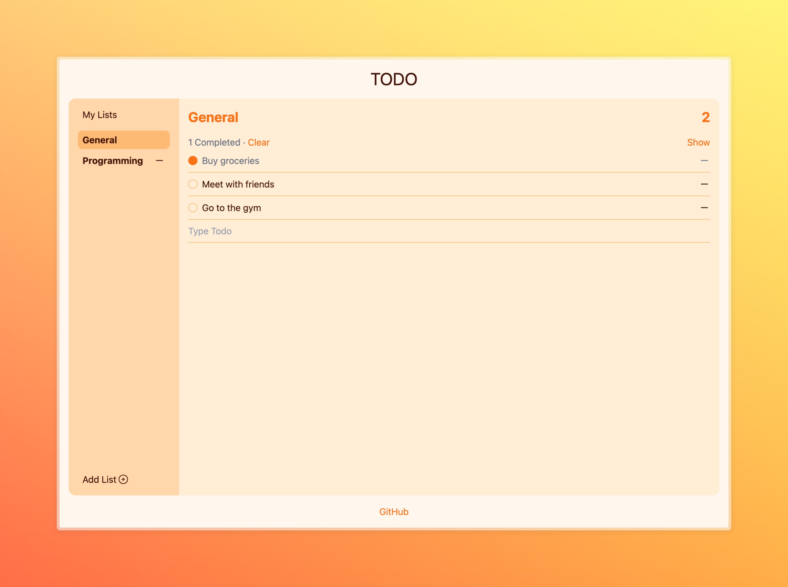

# TODO

[](https://github.com/amalumian/ta-todo/actions/workflows/ci.yml)

This is a simple to-do list application where users can create and manage different lists of tasks. The main screen displays the tasks within a selected list, with options to mark tasks as completed, clear completed tasks, and add new tasks. The interface also allows users to switch between different lists and add new lists.

## Local Run

```bash
npm install && npm run dev
```

## Tech Stack

- React
- Redux Toolkit, React-Redux
- TypeScript
- Tailwind CSS
- Vitest, React Testing Library
- Vite
- CI

## Screenshot


